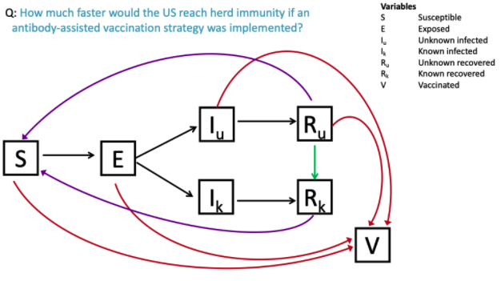

```{r, include=F}
library(tidyverse)
library(magrittr)
library(deSolve)
library(here)
library(ggnewscale)
library(patchwork)
library(lhs)
library(sensitivity)
```

Table of Contents
1. Conceptual Diagram
2. Equations w/0 vaccination
3. Equations w/ vaccination
4. Parameters
5. Parameter selection
6. Simulations for R0 and herd immunity threshold
7. Latin Hypercube Sampling
8. Partial Rank Correlation Coefficients




Equations
w/o vaccinations
$$
\begin{aligned}
 \frac{dS}{dt} &= -\beta_1 S I_k - \beta_2 S I_u + \lambda - \mu S\\ \\
 \frac{dE}{dt} &=  \beta_1 S I_k + \beta_2 S I_u - \psi \theta E - (1-\psi) \theta E - \mu E\\ \\
 \frac{dI_k}{dt} &= \psi \theta E - \alpha I_k - \mu I_k\\ \\
 \frac{dI_u}{dt} &= (1-\psi) \theta E - \alpha I_u - \mu I_u\\ \\
 \frac{dR_k}{dt} &= \alpha I_k - \mu R_k\\ \\
 \frac{dR_u}{dt} &= \alpha I_u - \mu R_u\\ \\
\end{aligned}
$$
w/ vaccinations
$$
\begin{aligned}
 \frac{dS}{dt} &= -\beta_1 S I_k - \beta_2 S I_u - \phi \gamma - (1-\phi) \gamma (S/U) + \lambda - \mu S\\ \\
 \frac{dE}{dt} &=  \beta_1 S I_k + \beta_2 S I_u - \psi \theta E - (1-\psi) \theta E - (1-\phi) \gamma (E/U) - \mu E\\ \\
 \frac{dI_k}{dt} &= \psi \theta E - \alpha I_k - \mu I_k\\ \\
 \frac{dI_u}{dt} &= (1-\psi) \theta E - \alpha I_u - (1-\phi) \gamma (I_u/U) - \mu I_u\\ \\
 \frac{dR_k}{dt} &= \alpha I_k - \mu R_k\\ \\
 \frac{dR_u}{dt} &= \alpha I_u - (1-\phi) \gamma (R_u/U) - \mu R_u\\ \\
 \frac{dV}{dt} &= \gamma - \mu V\\ \\
\end{aligned}
$$
Parameters

$$
\begin{align*}
 & U = unknown\ immunity\ status:\ S+E+I_u+R_u\\ \\
 & \lambda = constant\ birth\ rate\\ \\
 & \mu = per\ capita\ mortality\ rate\\ \\
 & \beta = transmission\ rate\\ \\ 
 & \phi = antibody\ testing\ strength:\ 0-1\\ \\ 
 & \theta = incubation\ period\\ \\
 & \alpha = recovery\ rate\\ \\
 & \psi = COVID\ testing\ strength:\ 0-1\\ \\
 & \gamma = daily\ vaccinations\\ \\
\end{align*}
$$


Grid Search Through Parameters
```{r, evaluate=F}
#Grid search through parameters

K <- 125000
mu <- 1/(365*75)
lambda <- K*mu
R0 <- 2
alpha <- 1/7
beta <- (R0*alpha)/K
theta <- 1/5

data <- expand.grid(psi = 1, #proportion individuals in known infected class
                   theta = theta, #incubation period
                   alpha = alpha, #recovery period
                   mu = mu, #per capita mortality rate for uninfected
                   mu1 = mu, #per capita mortality rate for infected
                   beta1 = beta, #transmission rate for symptomatic
                   beta2 = beta, #transmission rate for asymptomatic
                   lambda = lambda) #constant birth rate


mat <- matrix(1:9, nrow = 3, ncol = 3)

data %<>% add_column(dfe = (data$lambda/data$mu))

m <- nrow(data)

for(n in 1:m){
  mat[1] = 0
  mat[2] = ((data$beta1[n])*(data$dfe[n]))/(data$theta[n]+data$mu[n])
  mat[3] = ((data$beta2[n])*(data$dfe[n]))/(data$theta[n]+data$mu[n])
  mat[4] = (data$psi[n]*data$theta[n])/(data$alpha[n]+data$mu1[n])
  mat[5] = 0
  mat[6] = 0
  mat[7] = ((1-data$psi[n])*data$theta[n])/(data$alpha[n]+data$mu1[n])
  mat[8] = 0
  mat[9] = 0
  eigen <- max(eigen(mat)$values)
  data$eigen[n] <- eigen
}

```

ODE
Define functions and variables for deSolve
```{r, }
de<-function(t,x,params){
  S <- x[1]
  E <- x[2]
  Ik <- x[3]
  Iu <- x[4]
  Rk <- x[5]
  Ru <- x[6]
  V <- x[7]
  with(as.list(params),{
    dS <- -beta1*S*Ik - beta2*S*Iu - phi*gamma - (1-phi)*gamma*(S/(S+E+Iu+Ru)) + lambda - mu*S
    dE <- beta1*S*Ik + beta2*S*Iu - psi*theta*E - (1-psi)*theta*E - (1-phi)*gamma*(E/(S+E+Iu+Ru)) - mu*E
    dIk <- psi*theta*E - alpha*Ik - mu1*Ik
    dIu <- (1-psi)*theta*E - alpha*Iu - (1-phi)*gamma*(Iu/(S+E+Iu+Ru)) - mu1*Iu
    dRk <- alpha*Ik - mu*Rk
    dRu <- alpha*Iu - (1-phi)*gamma*(Ru/(S+E+Iu+Ru)) - mu*Ru
    dV <- gamma - mu*V
    res<-c(dS,dE,dIk,dIu,dRk,dRu,dV)
    list(res)
  })}

# notes on params
# beta =      <- contact transmission rate
# lambda =    <- constant growth rate
# mu =        <- density-dependent mortality rate
# phi =       <- range: 0-1 proportion vaccines targeted to known susceptible individuals
# psi =       <- range: 0-1 probability infected individuals are identified
# theta =      <- incubation period
# alpha =     <- recovery rate
# gamma =     <- number of daily vaccines
```


```{r, }
vaccinate <- function (psi_list, R0_list, K, mu, mu1, theta = 1/5, alpha = 1/7, gamma, beta1_mult, beta2_mult, xstart, maxTime=200){
final <- list()
times <- times<-seq(0,maxTime,by=0.1)
for (i in 1:length(psi_list)){
  psi <- psi_list[i]
  R0_lines <- list()
  for (j in 1:length(R0_list)){
    R0 <- R0_list[j]
    beta <- (R0*(alpha))/K

    psi = psi/100 #proportion individuals in known infected class
    theta = theta #incubation period
    alpha = alpha #recovery period
    mu = mu #per capita mortality rate for uninfected
    mu1 = mu1 #per capita mortality rate for infected
    beta1 = beta*beta1_mult #transmission rate for symptomatic
    beta2 = beta*beta2_mult #transmission rate for asymptomatic
    lambda = lambda #constant birth rate
    dfe =lambda/mu
  
    mat <- matrix(1:9, nrow = 3, ncol = 3)
    
   
    mat[1] = 0
    mat[2] = ((beta1)*(dfe))/(theta+mu)
    mat[3] = ((beta2)*(dfe))/(theta+mu)
    mat[4] = (psi*theta)/(alpha+mu1)
    mat[5] = 0
    mat[6] = 0
    mat[7] = ((1-psi)*theta)/(alpha+mu1)
    mat[8] = 0
    mat[9] = 0
    eigen <- max(eigen(mat)$values)
    
    threshold <- (1-1/eigen)*K
    phi <- c(0)
    time <- c(0)
    R_u <- c(0)
    herd <- tibble(phi, time, R_u, eigen, threshold,.rows = 11)
    for (k in 0:10){
      params<-c(beta1=beta1,
                beta2=beta2,
                lambda=lambda,
                mu=mu,
                mu1=mu,
                phi=k*10/100,
                psi=psi/100,
                theta=theta,
                alpha=alpha,
                gamma=gamma) 

      output<-as.data.frame(lsoda(xstart,times,de,params)) # tells computer to solve (integrate) equations
      output$herd <- output$S<=threshold
      tmp <- output %>% filter(herd==1)
      herd$phi[k+1] <- as.numeric(params[6])
      herd$time[k+1] <- tmp$time[1]
      herd$R_u[k+1] <- tmp$Ru[1]
    }
    R0_lines[[j]] <- herd
  }
  final[[i]] <- R0_lines
}
return(final)
}
```


```{r, }
vacc_plot <- function(final, ymax, psi_seq){
plot1 <- ggplot() + geom_line(data = final[[psi_seq]][[1]],aes(x=phi, y=time), color="red") +
  geom_line(data = final[[psi_seq]][[2]],aes(x=phi, y=time),color="forestgreen") +
  geom_line(data = final[[psi_seq]][[3]],aes(x=phi, y=time),color="blue") + 
  xlab("phi") + ylab("time") + 
  ylim(0,ymax)
  return(plot1)
}
vacc_plot_all <- function(final, ymax){

plot1 <- ggplot() + geom_line(data = final[[1]][[1]],aes(x=phi, y=time), color="red") +
  geom_line(data = final[[1]][[2]],aes(x=phi, y=time),color="forestgreen") +
  geom_line(data = final[[1]][[3]],aes(x=phi, y=time),color="blue") + 
  xlab("phi") + ylab("time") + labs(title = "20% infections unknown") +
  theme(axis.title.x = element_blank()) + ylim(0,ymax)

# plot2 <- ggplot() + geom_line(data = final[[2]][[1]],aes(x=phi, y=time), color="red") +
#   geom_line(data = final[[2]][[2]],aes(x=phi, y=time),color="forestgreen") +
#   geom_line(data = final[[2]][[3]],aes(x=phi, y=time),color="blue") + 
#   xlab("phi") + ylab("time") + labs(title = "50% infections known") + 
#   theme(axis.title.y = element_blank(), axis.text.y = element_blank(), axis.ticks.y=element_blank()) + ylim(0,ymax)

plot3 <- ggplot() + geom_line(data = final[[3]][[1]],aes(x=phi, y=time), color="red") +
  geom_line(data = final[[3]][[2]],aes(x=phi, y=time),color="forestgreen") +
  geom_line(data = final[[3]][[3]],aes(x=phi, y=time),color="blue") + 
  xlab("phi") + ylab("time") + labs(title = "80% infections unknown") + 
  theme(axis.title.y = element_blank(), axis.text.y = element_blank(), axis.ticks.y=element_blank(), axis.title.x = element_blank()) + ylim(0,ymax)

final_plot <- plot1|plot3

return(final_plot)
}
```


```{r}
#US dec. 14
psi_list <- c(80,50,20)
R0_list <- c(1.7,2.3,2.7)

K <- 330001060

mu <- 1/(365*75)
lambda <- K*mu
theta <- 1/5
alpha <- 1/7
gamma <- K*0.003030

xstart <- c(
S=K*0.7119,
E=K*0.0107,
Ik=K*0.0088,
Iu=K*0.0234,
Rk=K*0.0480,
Ru=K*0.1972,
V=K*0.0000)

US_dec <- vaccinate(psi_list,R0_list,K,mu,mu,theta,alpha,gamma,beta1_mult=1,beta2_mult=1,xstart, maxTime = 250)
US_dec_plots <- vacc_plot_all(US_dec, ymax=250)
US_dec_plots
US_dec_plot <- vacc_plot(US_dec, ymax=175, psi_seq=3)
p_a <- US_dec_plot + labs(title = "US Dec. 14th start")
```


```{r}
#US jan. 14
psi_list <- c(80,50,20)
R0_list <- c(1.7,2.3,2.7)

K <- 330047464

mu <- 1/(365*75)
lambda <- K*mu
theta <- 1/5
alpha <- 1/7
gamma <- K*0.003030

xstart <- c(
S=K*0.5313,
E=K*0.0134,
Ik=K*0.0092,
Iu=K*0.0341,
Rk=K*0.0667,
Ru=K*0.2514,
V=K*0.0939)

US_jan <-vaccinate(psi_list,R0_list,K,mu,mu,theta,alpha,gamma,beta1_mult=1,beta2_mult=1,xstart, maxTime = 250)
#US_jan_plots <- vacc_plot_all(US_dec, ymax=250)
US_jan_plot <- vacc_plot(US_jan, ymax=175, psi_seq = 3)
p_b <- US_jan_plot + labs(title = "US Jan. 14th start") + theme(axis.title.y = element_blank())
```


```{r}
#GA dec. 14
psi_list <- c(80,50,20)
R0_list <- c(1.7,2.3,2.7)

K <- 10617423

mu <- 1/(365*75)
lambda <- K*mu
theta <- 1/5
alpha <- 1/7
gamma <- K*0.004709

xstart <- c(
S=K*0.7276,
E=K*0.0095,
Ik=K*0.0072,
Iu=K*0.0190,
Rk=K*0.0451,
Ru=K*0.1915,
V=K*0.0000)

GA_dec <- vaccinate(psi_list,R0_list,K,mu,mu,theta,alpha,gamma,beta1_mult=1,beta2_mult=1,xstart, maxTime = 200)
GA_dec_beta2_1.5 <- vaccinate(psi_list,R0_list,K,mu,mu,theta,alpha,gamma,beta1_mult=1,beta2_mult=1.5,xstart, maxTime = 200)
GA_dec_beta1_1.5 <- vaccinate(psi_list,R0_list,K,mu,mu,theta,alpha,gamma,beta1_mult=1.5,beta2_mult=1,xstart, maxTime = 200)


GA_dec_plots_1_1.5 <- vacc_plot_all(GA_dec_beta1_1.5, ymax=100)
GA_dec_plots_2_1.5 <- vacc_plot_all(GA_dec_beta2_1.5, ymax=200)
GA_dec_plots <- vacc_plot_all(GA_dec, ymax=150)
GA_dec_plot <- vacc_plot(GA_dec, ymax=125, psi_seq=3)
p_c <- GA_dec_plot + labs(title = "GA Dec. 14th start")
```

make plots for fig 4
```{r}
plot_time_20 <- ggplot() + geom_line(data = GA_dec[[1]][[1]],aes(x=phi, y=time), color="red") +
  geom_line(data = GA_dec[[1]][[2]],aes(x=phi, y=time),color="forestgreen") +
  geom_line(data = GA_dec[[1]][[3]],aes(x=phi, y=time),color="blue") + 
  xlab("phi") + ylab("Time") + labs(title = "80%") +
  theme() + ylim(0,125)

plot_time_80 <- ggplot() + geom_line(data = GA_dec[[3]][[1]],aes(x=phi, y=time), color="red") +
  geom_line(data = GA_dec[[3]][[2]],aes(x=phi, y=time),color="forestgreen") +
  geom_line(data = GA_dec[[3]][[3]],aes(x=phi, y=time),color="blue") + 
  xlab("phi") + ylab("Time") + labs(title = "20%") +
  theme(axis.title.y = element_blank(), axis.text.y = element_blank(), axis.ticks.y=element_blank()) + ylim(0,125)

plot_Ru_20 <- ggplot() + geom_line(data = GA_dec[[1]][[1]],aes(x=phi, y=R_u), color="red") +
  geom_line(data = GA_dec[[1]][[2]],aes(x=phi, y=R_u),color="forestgreen") +
  geom_line(data = GA_dec[[1]][[3]],aes(x=phi, y=R_u),color="blue") + 
  xlab("phi") + ylab("Ru") + labs(title = "phi = 80%") +
  theme() + ylim(1750000,4000000)

plot_Ru_80 <- ggplot() + geom_line(data = GA_dec[[3]][[1]],aes(x=phi, y=R_u), color="red") +
  geom_line(data = GA_dec[[3]][[2]],aes(x=phi, y=R_u),color="forestgreen") +
  geom_line(data = GA_dec[[3]][[3]],aes(x=phi, y=R_u),color="blue") + 
  xlab("phi") + ylab("Ru") + labs(title = "20%") +
  theme(axis.title.y = element_blank(), axis.text.y = element_blank(), axis.ticks.y=element_blank()) + ylim(1750000,4000000)

beta_equal_plot <- plot_Ru_20 | plot_Ru_80 | plot_time_20 | plot_time_80

```
make plots for fig 5

```{r}
plot_time_20 <- ggplot() + geom_line(data = GA_dec_beta1_1.5[[1]][[1]],aes(x=phi, y=time), color="red") +
  geom_line(data = GA_dec_beta1_1.5[[1]][[2]],aes(x=phi, y=time),color="forestgreen") +
  geom_line(data = GA_dec_beta1_1.5[[1]][[3]],aes(x=phi, y=time),color="blue") + 
  xlab("phi") + ylab("Time") + labs(title = "80%") +
  theme() + ylim(0,100)

plot_time_80 <- ggplot() + geom_line(data = GA_dec_beta1_1.5[[3]][[1]],aes(x=phi, y=time), color="red") +
  geom_line(data = GA_dec_beta1_1.5[[3]][[2]],aes(x=phi, y=time),color="forestgreen") +
  geom_line(data = GA_dec_beta1_1.5[[3]][[3]],aes(x=phi, y=time),color="blue") + 
  xlab("phi") + ylab("Time") + labs(title = "20%") +
  theme(axis.title.y = element_blank(), axis.text.y = element_blank(), axis.ticks.y=element_blank()) + ylim(0,100)

plot_Ru_20 <- ggplot() + geom_line(data = GA_dec_beta1_1.5[[1]][[1]],aes(x=phi, y=R_u), color="red") +
  geom_line(data = GA_dec_beta1_1.5[[1]][[2]],aes(x=phi, y=R_u),color="forestgreen") +
  geom_line(data = GA_dec_beta1_1.5[[1]][[3]],aes(x=phi, y=R_u),color="blue") + 
  xlab("phi") + ylab("Ru") + labs(title = "phi = 80%") +
  theme() + ylim(2250000,4000000)

plot_Ru_80 <- ggplot() + geom_line(data = GA_dec_beta1_1.5[[3]][[1]],aes(x=phi, y=R_u), color="red") +
  geom_line(data = GA_dec_beta1_1.5[[3]][[2]],aes(x=phi, y=R_u),color="forestgreen") +
  geom_line(data = GA_dec_beta1_1.5[[3]][[3]],aes(x=phi, y=R_u),color="blue") + 
  xlab("phi") + ylab("Ru") + labs(title = "20%") +
  theme(axis.title.y = element_blank(), axis.text.y = element_blank(), axis.ticks.y=element_blank()) + ylim(2250000,4000000)

beta_diff_plot <- plot_Ru_20 | plot_Ru_80 | plot_time_20 | plot_time_80
```


```{r}
#GA jan. 14
psi_list <- c(80,50,20)
R0_list <- c(1.7,2.3,2.7)

K <- 10617423

mu <- 1/(365*75)
lambda <- K*mu
theta <- 1/5
alpha <- 1/7
gamma <- K*0.004709

xstart <- c(
S=K*0.4641,
E=K*0.0155,
Ik=K*0.0125,
Iu=K*0.0464,
Rk=K*0.0622,
Ru=K*0.2532,
V=K*0.1460)

GA_jan <- vaccinate(psi_list,R0_list,K,mu,mu,theta,alpha,gamma,beta1_mult=1,beta2_mult=1,xstart, maxTime = 200)
#GA_jan_plots <- vacc_plot_all(GA_jan, ymax=200)
GA_jan_plot <- vacc_plot(GA_jan, ymax=125, psi_seq = 3)
p_d <- GA_jan_plot + labs(title = "GA Jan. 14th start") + theme(axis.title.y=element_blank())
```

make plots for fig 3
```{r}
US_plots <- p_a | p_b
GA_plots <- p_c | p_d
all_plots <- p_a |p_b | p_c | p_d
```


Plots for transmission Dynamics
Keep psi the same but change phi with high R0 (1.7)
```{r, }

K <- 10617423

mu <- 1/(365*75)
lambda <- K*mu
theta <- 1/5
alpha <- 1/7
gamma <- K*0.004709
R0 <- 1.7
beta <- (R0*(alpha))/K

mat <- matrix(1:9, nrow = 3, ncol = 3)


mat[1] = 0
mat[2] = ((beta1)*(dfe))/(theta+mu)
mat[3] = ((beta2)*(dfe))/(theta+mu)
mat[4] = (psi*theta)/(alpha+mu1)
mat[5] = 0
mat[6] = 0
mat[7] = ((1-psi)*theta)/(alpha+mu1)
mat[8] = 0
mat[9] = 0
eigen <- max(eigen(mat)$values)

threshold <- (1-(1/eigen))*K

xstart <- c(
S=K*0.7276,
E=K*0.0095,
Ik=K*0.0072,
Iu=K*0.0190,
Rk=K*0.0451,
Ru=K*0.1915,
V=K*0.0000)


params<-c(beta1=beta,
          beta2=beta,
          lambda=lambda,
          mu=mu,
          mu1=mu,
          phi=0/100,
          psi=80/100,
          theta=theta,
          alpha=alpha,
          gamma=gamma) 

times<-seq(0,100,by=0.1)


output<-as.data.frame(lsoda(xstart,times,de,params)) # tells computer to solve (integrate) equations

p1 <- output %>% ggplot(.,aes(x=time))+
  geom_line(aes(y=S,col="Susceptible"))+
  geom_line(aes(y=E,col="Exposed"))+
  geom_line(aes(y=Ik,col="Infected_k"))+
  geom_line(aes(y=Iu,col="Infected_u"))+
  geom_line(aes(y=Rk,col="Recovered_k"))+
  geom_line(aes(y=Ru,col="Recovered_u"))+
  geom_line(aes(y=V,col="Vaccinated"))+
  scale_colour_manual(values = c("red","orange","hotpink","green","blue","purple","gray","black"))+
  theme(legend.position = "none")+
  labs(y="N",x="Time",col="Population")+
  ggtitle("Vaccinations without Ab testing (i.e. phi = 0)")+
  geom_hline(yintercept=threshold)

params<-c(beta1=beta,
          beta2=beta,
          lambda=lambda,
          mu=mu,
          mu1=mu,
          phi=100/100,
          psi=80/100,
          theta=theta,
          alpha=alpha,
          gamma=gamma) 

output1<-as.data.frame(lsoda(xstart,times,de,params)) # tells computer to solve (integrate) equations

p2 <- output1 %>% ggplot(.,aes(x=time))+
  geom_line(aes(y=S,col="Susceptible"))+
  geom_line(aes(y=E,col="Exposed"))+
  geom_line(aes(y=Ik,col="Infected_k"))+
  geom_line(aes(y=Iu,col="Infected_u"))+
  geom_line(aes(y=Rk,col="Recovered_k"))+
  geom_line(aes(y=Ru,col="Recovered_u"))+
  geom_line(aes(y=V,col="Vaccinated"))+
  scale_colour_manual(values = c("red","orange","hotpink","green","blue","purple","gray","black"))+
  labs(y="N",x="Time",col="Population")+
  ggtitle("Vaccinations with Ab testing (i.e. phi = 1)")+
  geom_hline(yintercept=threshold)

pf <- p1/p2
```

Everything after this is just more exploration of the model and testing of some concepts


Keep psi the same but change phi with high R0 (2.7)
```{r, }

K <- 10617423

mu <- 1/(365*75)
lambda <- K*mu
theta <- 1/5
alpha <- 1/7
gamma <- K*0.004709
R0 <- 2.7
beta <- (R0*(alpha))/K

mat <- matrix(1:9, nrow = 3, ncol = 3)


mat[1] = 0
mat[2] = ((beta1)*(dfe))/(theta+mu)
mat[3] = ((beta2)*(dfe))/(theta+mu)
mat[4] = (psi*theta)/(alpha+mu1)
mat[5] = 0
mat[6] = 0
mat[7] = ((1-psi)*theta)/(alpha+mu1)
mat[8] = 0
mat[9] = 0
eigen <- max(eigen(mat)$values)

threshold <- (1-(1/eigen))*K

xstart <- c(
S=K*0.7276,
E=K*0.0095,
Ik=K*0.0072,
Iu=K*0.0190,
Rk=K*0.0451,
Ru=K*0.1915,
V=K*0.0000)


params<-c(beta1=beta,
          beta2=beta,
          lambda=lambda,
          mu=mu,
          mu1=mu,
          phi=10/100,
          psi=80/100,
          theta=theta,
          alpha=alpha,
          gamma=gamma) 

times<-seq(0,100,by=0.1)


output<-as.data.frame(lsoda(xstart,times,de,params)) # tells computer to solve (integrate) equations

output %>% ggplot(.,aes(x=time))+
  geom_line(aes(y=S,col="Susceptible"))+
  geom_line(aes(y=E,col="Exposed"))+
  geom_line(aes(y=Ik,col="Infected_k"))+
  geom_line(aes(y=Iu,col="Infected_u"))+
  geom_line(aes(y=Rk,col="Recovered_k"))+
  geom_line(aes(y=Ru,col="Recovered_u"))+
  geom_line(aes(y=V,col="Vaccinated"))+
  scale_colour_manual(values = c("red","orange","hotpink","green","blue","purple","gray","black"))+
  #theme(legend.position = c(0.75,0.4))+
  labs(y="N",x="Time",col="Population")+
  #ggtitle("Transmission Model for Antibody-Assisted Vaccinations")+
  theme(plot.title = element_text(hjust=, size=10))+
  geom_hline(yintercept=threshold)

params<-c(beta1=beta,
          beta2=beta,
          lambda=lambda,
          mu=mu,
          mu1=mu,
          phi=90/100,
          psi=80/100,
          theta=theta,
          alpha=alpha,
          gamma=gamma) 

output<-as.data.frame(lsoda(xstart,times,de,params)) # tells computer to solve (integrate) equations

output %>% ggplot(.,aes(x=time))+
  geom_line(aes(y=S,col="Susceptible"))+
  geom_line(aes(y=E,col="Exposed"))+
  geom_line(aes(y=Ik,col="Infected_k"))+
  geom_line(aes(y=Iu,col="Infected_u"))+
  geom_line(aes(y=Rk,col="Recovered_k"))+
  geom_line(aes(y=Ru,col="Recovered_u"))+
  geom_line(aes(y=V,col="Vaccinated"))+
  scale_colour_manual(values = c("red","orange","hotpink","green","blue","purple","gray","black"))+
  #theme(legend.position = c(0.75,0.4))+
  labs(y="N",x="Time",col="Population")+
  #ggtitle("Transmission Model for Antibody-Assisted Vaccinations")+
  geom_hline(yintercept=threshold)
```


Keep phi the same but change psi (check this with different R0)
```{r, }

K <- 10617423

mu <- 1/(365*75)
lambda <- K*mu
theta <- 1/5
alpha <- 1/7
gamma <- K*0.004709
R0 <- 2.7
beta <- (R0*(alpha))/K

mat <- matrix(1:9, nrow = 3, ncol = 3)


mat[1] = 0
mat[2] = ((beta1)*(dfe))/(theta+mu)
mat[3] = ((beta2)*(dfe))/(theta+mu)
mat[4] = (psi*theta)/(alpha+mu1)
mat[5] = 0
mat[6] = 0
mat[7] = ((1-psi)*theta)/(alpha+mu1)
mat[8] = 0
mat[9] = 0
eigen <- max(eigen(mat)$values)

threshold <- (1-(1/eigen))*K

xstart <- c(
S=K*0.7276,
E=K*0.0095,
Ik=K*0.0072,
Iu=K*0.0190,
Rk=K*0.0451,
Ru=K*0.1915,
V=K*0.0000)


params<-c(beta1=beta,
          beta2=beta,
          lambda=lambda,
          mu=mu,
          mu1=mu,
          phi=10/100,
          psi=20/100,
          theta=theta,
          alpha=alpha,
          gamma=gamma) 

times<-seq(0,100,by=0.1)


output<-as.data.frame(lsoda(xstart,times,de,params)) # tells computer to solve (integrate) equations

output %>% ggplot(.,aes(x=time))+
  geom_line(aes(y=S,col="Susceptible"))+
  geom_line(aes(y=E,col="Exposed"))+
  geom_line(aes(y=Ik,col="Infected_k"))+
  geom_line(aes(y=Iu,col="Infected_u"))+
  geom_line(aes(y=Rk,col="Recovered_k"))+
  geom_line(aes(y=Ru,col="Recovered_u"))+
  geom_line(aes(y=V,col="Vaccinated"))+
  scale_colour_manual(values = c("red","orange","hotpink","green","blue","purple","gray","black"))+
  #theme(legend.position = c(0.75,0.4))+
  labs(y="N",x="Time",col="Population")+
  #ggtitle("Transmission Model for Antibody-Assisted Vaccinations")+
  theme(plot.title = element_text(hjust=, size=10))+
  geom_hline(yintercept=threshold)

params<-c(beta1=beta,
          beta2=beta,
          lambda=lambda,
          mu=mu,
          mu1=mu,
          phi=10/100,
          psi=80/100,
          theta=theta,
          alpha=alpha,
          gamma=gamma) 

output<-as.data.frame(lsoda(xstart,times,de,params)) # tells computer to solve (integrate) equations

output %>% ggplot(.,aes(x=time))+
  geom_line(aes(y=S,col="Susceptible"))+
  geom_line(aes(y=E,col="Exposed"))+
  geom_line(aes(y=Ik,col="Infected_k"))+
  geom_line(aes(y=Iu,col="Infected_u"))+
  geom_line(aes(y=Rk,col="Recovered_k"))+
  geom_line(aes(y=Ru,col="Recovered_u"))+
  geom_line(aes(y=V,col="Vaccinated"))+
  scale_colour_manual(values = c("red","orange","hotpink","green","blue","purple","gray","black"))+
  #theme(legend.position = c(0.75,0.4))+
  labs(y="N",x="Time",col="Population")+
  #ggtitle("Transmission Model for Antibody-Assisted Vaccinations")+
  geom_hline(yintercept=threshold)
```